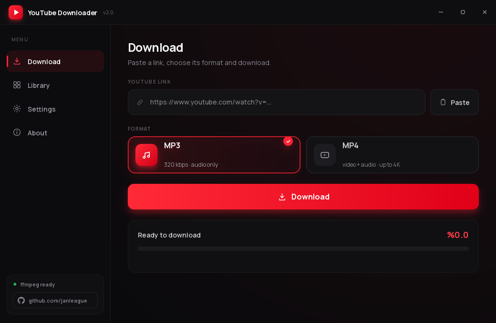
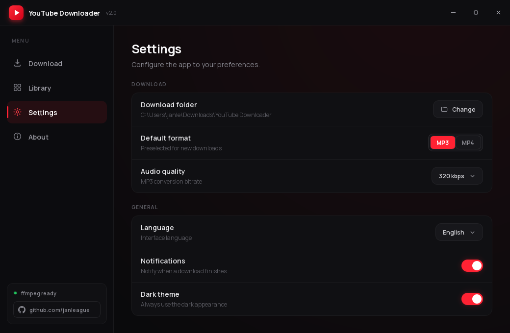
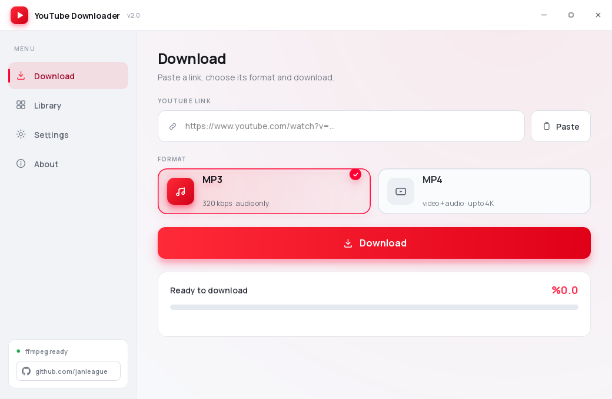
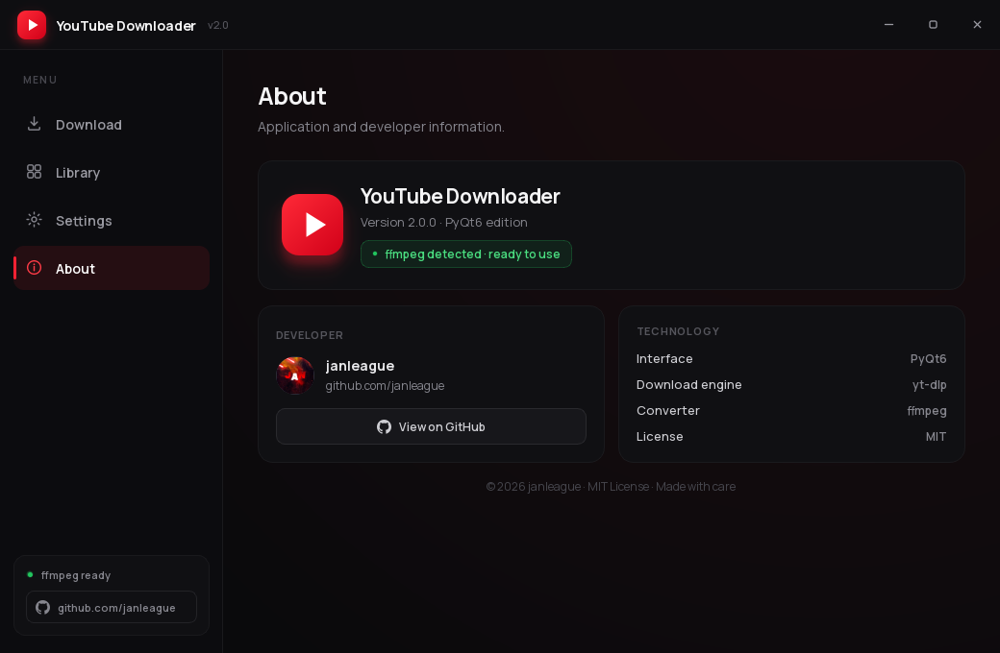
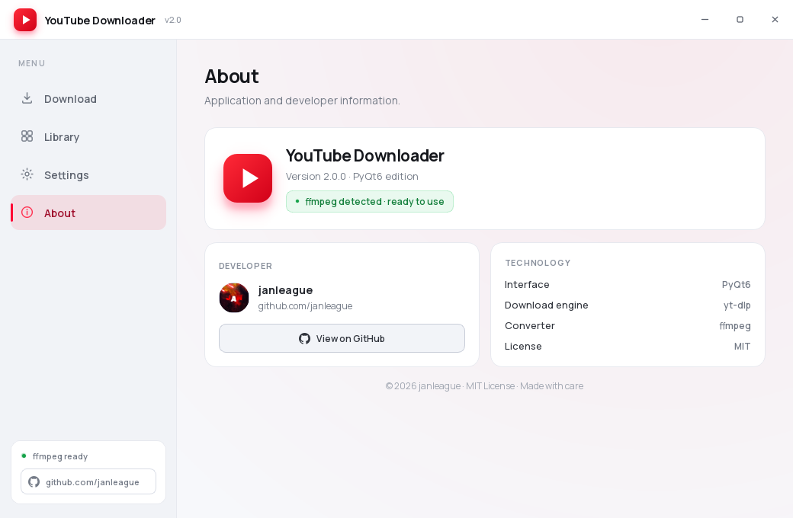
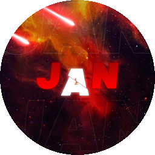

<div align="center">
  
  <h1>YouTube Downloader</h1>
  <p>Premium, native Windows downloader for YouTube video and audio.</p>

  [](https://github.com/janleague/youtube-downloader/releases/latest)
  [](https://github.com/janleague/youtube-downloader/releases/latest)
  [](https://www.python.org/)
  [](LICENSE)

  **[Download the Windows installer](https://github.com/janleague/youtube-downloader/releases/latest)**
</div>



## Highlights

- MP3 conversion at 128, 192, 256 or 320 kbps
- MP4 downloads from 360p up to 2160p
- Live progress, speed, remaining time and clear status feedback
- Native dark and light themes
- Download history with search and direct file opening
- Turkish and English interface
- Persistent folder, format, quality and notification preferences
- Automatic `Downloads\YouTube Downloader` folder creation
- Frameless custom window, subtle glow effects and bundled Sora/Manrope fonts
- Windows installer, Start Menu shortcut and optional FFmpeg setup

## Interface

| Dark theme | Light theme |
| --- | --- |
|  |  |
|  |  |

The About page loads the developer's current GitHub profile avatar directly
from GitHub and uses the packaged real avatar as an offline fallback.

## Install

### Recommended

Download `YouTubeDownloader-Setup-v2.0.0.exe` from the
[latest release](https://github.com/janleague/youtube-downloader/releases/latest).
The installer adds Start Menu and optional desktop shortcuts. FFmpeg can also
be installed through the optional installer task.

### Portable

Download `YouTubeDownloader.exe` from the same release and run it directly.

Windows SmartScreen may show a warning because the binaries are not
code-signed. You can inspect the source and verify downloads with the published
`SHA256SUMS.txt` file.

## Run from source

Requirements:

- Windows 10 or Windows 11
- Python 3.10+
- FFmpeg for MP3 conversion and high-quality MP4 merging

```powershell
git clone https://github.com/janleague/youtube-downloader.git
cd youtube-downloader
python -m pip install -r requirements.txt
python main.py
```

Install FFmpeg when needed:

```powershell
winget install --id Gyan.FFmpeg --exact
```

## Build

`build_exe.bat` creates both the portable executable and the Inno Setup
installer:

```powershell
.\build_exe.bat
```

Outputs:

```text
dist\YouTubeDownloader.exe
dist\YouTubeDownloader-Setup-v2.0.0.exe
```

GitHub Actions also performs a clean Windows build for every push and attaches
the binaries to tagged releases.

## Project structure

```text
core/       yt-dlp integration, download controller, settings and library
pages/      Download, Library, Settings and About screens
widgets/    Shared PyQt6 components, sidebar and custom title bar
assets/     Packaged developer avatar
fonts/      Bundled Sora and Manrope fonts
scripts/    Asset and screenshot generation helpers
```

## Notes

- Supported links include regular videos, Shorts and `youtu.be` URLs.
- Playlist links are handled in single-video mode.
- Only download media you are authorized to access. You are responsible for
  complying with applicable copyright rules and platform terms.
- This project is not affiliated with or endorsed by YouTube or Google.

## Developer

<p>
  
  <strong><a href="https://github.com/janleague">janleague</a></strong><br>
  Built with PyQt6, yt-dlp and FFmpeg.<br>
  Released under the <a href="LICENSE">MIT License</a>.
</p>
